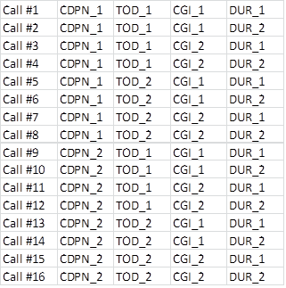

= TCC Useful Functions for TTCN-3 Toolset with TITAN, Description
:author: Gábor Szalai
:revnumber: 1551-CNL 113 472, Rev. AJ
:revdate: 2018-05-29
:toc:

== How to Read This Document

This is the Function Specification for the TCC Useful Functions. The modules are developed for the TTCN-3 Toolset with TITAN.

== Presumed Knowledge

The knowledge of the TITAN TTCN-3 Test Executor <<_3, [3]>> and the TTCN-3 language <<_1, [1]>> is essential. Other documents that the reader should be familiar with are referenced in the consecutive section of each function.

= Functionality

The functions described in this document are TTCN-3 or external TTCN-3 functions. TTCN-3 functions are implemented in TTCN-3 language; external TTCN-3 functions are implemented in C++.

== Implemented Protocols

None.

== Supported Standards

None.

== Routing Functionality

Routing functionality is not performed.

== Modified and Non-Implemented Protocol Elements

None.

== Backward Incompatibilities

=== R35A

The non-open source `TCCSecurity_Functions` are moved to a separate product.

The TCC Security Functions CNL 113 874 should be added to the project if the moved functions are used.

If the non-moved functions are used in the project the `TCCOpenSecurity_Functions` should be imported instead of `TCCSecurity_Functions`

* Moved files:

** _TCCSecurity.cc_
** __TCCSecurity_Functions.ttcn__
** __aka_algorythm_set.c__
** __aka_algorythm_set.h__
** _snow3g.c_
** _snow3g.h_
** _zuc.c_
** _zuc.h_

* Moved functions:

** `f_TCCSecurity_hex2char`
** `f_IMSAKA_f1`
** `f_IMSAKA_f1_opc`
** `f_IMSAKA_f2`
** `f_IMSAKA_f2_opc`
** `f_IMSAKA_f3`
** `f_IMSAKA_f3_opc`
** `f_IMSAKA_f4`
** `f_IMSAKA_f4_opc`
** `f_IMSAKA_f2345`
** `f_IMSAKA_f2345_opc`
** `f_IMSAKA_f5`
** `f_IMSAKA_f5_opc`
** `f_IMSAKA_f1star`
** `f_IMSAKA_f1star_opc`
** `f_IMSAKA_f5star`
** `f_IMSAKA_f5star_opc`
** `f_EAPSIM_A3A8`
** `f_IMSAKA_calculateAUTN`
** `f_calculate128_EEA3`
** `f_calculate128_EIA3`
** `f_calculate128_EEA1`
** `f_calculate128_EIA1`
** `f_calculate128_EIA2`
** `f_calculate128_EEA2`

== System Requirements

In order to operate any of the Useful Functions the following system requirements must be satisfied:

* TITAN TTCN-3 Test Executor version 6.3.pl0 (CRL 113 200/6 R3A) or higher installed. For installation guide see <<_2, [2]>>.

Further system requirements, if any, are listed in the consecutive section of each function.

== Installation

Since the Useful Functions are used as a part of the TTCN-3 test environment this requires TTCN-3 Test Executor to be installed before any operation of these functions. For more details on the installation of TTCN-3 Test Executor see the relevant section of <<_2, [2]>>.

If not otherwise noted in the respective sections, the following are needed to use the Useful Functions:

Copy the files listed in the section related to the specific functions to the directory of the test suite or create symbolic links to them.

* Import the TTCN-3 module containing the declaration of the functions to the modules that will use them.
* Create _Makefile_ or modify the existing one. For more detail see the relevant section of <<_3, [3]>>.

= Functions

= Message Encoding Functions

== Overview

Encoding functions can be used to encode data to a specific format or decode encoded data.

Encoding functions are implemented in the following files:

* __TCCEncoding_Functions.ttcn__: external TTCN-3 function declarations
* __TCCEncoding.cc__: source file of the functions

== Function Definitions

The following functions are defined in Encoding Functions:

* `external function enc_MIME_Base64(in octetstring p_msg) return charstring;`
+
Encodes the octetstring parameter `msg` to MIME Base64 format according to <<_3, [3]>>.

* `external function dec_MIME_Base64(in charstring p_b64) return octetstring;`
+
Decodes a MIME Base64 encoded character string to octetstring.

* `external function enc_LDIF_Base64(in octetstring p_msg) return charstring;`
+
Encodes the parameter `msg` to LDIF Base64 format according to <<_5, [5]>>.

* `external function dec_LDIF_Base64(in charstring p_b64) return octetstring;`
+
Decodes an LDIF Base64 encoded character string to octetstring.

* `function f_encGSM7bit(in universal charstring pl_str) return octetstring`
+
Encodes the parameter `pl_str` (containing characters of the default alphabet) to octetstring containing USSD packing <<_12, [12]>>.
+
NOTE: The Greek capital letters and the euro sign have to be represented in the "quadruple" notation (for example, the Greek capital letter delta is char(0, 0, 3, 148) )

* `function f_decGSM7bit(in octetstring pl_gsm7bit) return universal charstring`
+
Decodes a USSD packed encoded octetstring to characters of the default alphabet <<_12, [12]>>.
+
NOTE: Non-ASCII characters will be decoded into the quadruple notation. For example the Japanese yen symbol will be decoded to char(0, 0, 0, 165).

* `function f_is_TBCD(in charstring pl_number) return boolean;`
+
Returns `_true_` if the `pl_number` contains only valid TBCD characters, otherwise returns `_false_`. The valid TBCD characters are 0-9, *,#,a,b,c.

* `external function f_enc_TBCD(in charstring pl_char) return octetstring;`
+
Encodes the parameter `pl_char` (charstring containing valid TBCD characters) to octetstring using TBCD encoding <<_13, [13]>>. Valid TBCD characters are 0-9, *,#,a,b,c. If the encoding of an invalid character is attempted, an empty octetstring is returned with a warning.

* `external function f_dec_TBCD(in octetstring pl_oct) return charstring;`
+
Decodes a valid TBCD encoded octetstring to charstring format <<_13, [13]>>. If the encoding is incorrect then an empty charstring is returned with a warning.

* `function f_encode_ISUP_Called_Party_Number(in ISUP_Called_Party_Number pl_ISUP_Called_Party_Number) return octetstring`
+
Encodes `<ISUP_Called_Party_Number>` type to octetstring format. (Encoding defined in ISUP protocol <<_14, [14]>>, section 3.9)

* `function f_encode_ISUP_Calling_Party_Number(in ISUP_Calling_Party_Number pl_ISUP_Calling_Party_Number) return octetstring`
+
Encodes `<ISUP_Calling_Party_Number>` type to octetstring format. (Encoding defined in ISUP protocol <<_14, [14]>>, section 3.10)

* `function f_encode_MobileL3_CalledPartyBCDNumber(in MobileL3_CalledPartyBCDNumber pl_MobileL3_CalledPartyBCDNumber) return octetstring`
+
Encodes `<MobileL3_CalledPartyBCDNumber>` type to octetstring format. (Encoding defined in Mobile L3 protocol <<_15, [15]>>, section 10.5.4.7)

* `public function f_enc_TBCD_hex(in hexstring pl_hex) return octetstring`
+
The function converts a hexstring into TBCD-String format.

== Error Messages

None.

== Warning Messages

`*Warning: Invalid character in Base64 encoded data: …*`

This warning message is only printed by the function `dec_LDIF_Base64`, if the Base64 encoded data passed as a parameter contains one or more characters that are not defined in Base64 (i.e. a character other than [A-Z][a-z][0-9]/+). The decoded data may still be valid.

`*Warning : Invalid character <character> will be encoded as space!*`

Only characters contained in Section 6.2.1 of <<_12, [12]>> can be correctly encoded with `f_encGSM7bit`. Other characters will be encoded as space.

`*Warning : Unknown extension character <extension code> will be decoded as space!*`

Only extensions contained in section 6.2.1.1 of <<_12, [12]>> can be correctly decoded with `f_decGSM7bit`. Other extension characters will be decoded as space.

`*Warning : Filler digit at invalid location!*`

`f_dec_TBCD` returns an empty charstring and gives this warning if there is a filler digit at a location other than the msb side of the last octet.

`*Warning : Invalid TBCD digit!*`

`f_enc_TBCD` returns an empty octetstring and gives this warning if the encoding of an invalid TBCD character is attempted.

== Examples

[source]
----
module TCCEncoding_Example {

import from TCCEncoding_Functions all;

type component test_CT {
  var charstring base64;
  var octetstring msg, dec;
}

testcase TC() runs on test_CT
{
  msg := char2oct(“Test message.”);
  log(“Message is: ”, msg);
  base64 := enc_MIME_Base64(msg);
  log(“MIME Base64 encoded message is: ”, base64);
  dec := dec_MIME_Base64(base64);
  log(“Decoded message is: ”, dec);
  if(dec != msg) {
    setverdict(fail);
  } else {
    setverdict(pass);
  }
}
testcase tc_2() runs on MyComp
{
  var octetstring v_bit := f_encGSM7bit("The last transaction cost $ 0.25. Your account balance is $ 39.50. To refill your account go to www.att.com/GoPhone.")
log(v_bit)
var universal charstring v_char := f_decGSM7bit(v_bit);
log(v_char)
}
testcase tc_3() runs on MyComp
{ //Encoding and decoding the Greek capital letter delta
  var octetstring v_bit := f_encGSM7bit(char(0, 0, 3, 148))
log(v_bit)
var universal charstring v_char := f_decGSM7bit(v_bit);
log(v_char)
}
testcase tc_4() runs on MyComp
{
log(f_dec_TBCD('01234F6789ABCDFE'O))
log(f_enc_TBCD("0123456789*#abc"))
}

control {
  execute(TC());
  execute(tc_2());
  execute(tc_3());
  execute(tc_4());
}

}
----

= Test Environment Handling Functions

== Overview

Environment Handling Functions can be used to get or set environment variables.

Environment Handling Functions are implemented in the following files:

* __TCCEnv_Functions.ttcn__: external TTCN-3 function declarations
* _TCCEnv.cc_: source code of the functions

== Function Definitions

The following Environment Handling Functions are defined:

* `external function f_GetEnv(in charstring p_env_name) return charstring;`
+
Returns the environment variable `p_env_name`.

* `external function f_PutEnv(in charstring p_env_name, in charstring p_env_value) return boolean;`
+
Sets the environment variable `p_env_name` to `p_env_value`. Returns false on error, true on success.

== Error Messages

None.

== Warning Messages

`*putenv failed with error code …*`

An error happened while setting the environment variable.

== Examples

[source]
----
module TCCEnv_Example {

import from TCCEnv_Functions all;

type component test_CT { }

testcase TC() runs on test_CT
{
  log(“PATH=”, f_GetEnv(“PATH”));
  f_PutEnv(“ENV”, “foobar”);
  log(“ENV=”, f_GetEnv(“ENV”));
}

control {
  execute(TC());
}

}
----

= Network Interface Functions

== Overview

Network Interface Functions can be used to modify interface related settings. For example, get/set IP address, set up/down interface.

Interface Functions are supported only on Linux and Solaris. For the setter functions root privilege is necessary. Otherwise warning messages will appear.

Network Interface Functions are implemented in the following files:

* __TCCInterface_Functions.ttcn__
* _TCCInterface.cc_
* __TCCInterface_ip.h__

== Function Definitions

The following Network Interface Functions are defined.

* `external function f_getPortAvailabilityStatus(in charstring ipAddress, in integer portNumber, in TCCInterface_ProtocolType protocolType) return TCCInterface_PortStatus;`
+
The function returns what was the status of the IP/port/Protocol some time ago. The returned information was outdated before the function returned, so use it only as a hint.

* `external function f_setIP(in charstring interface, in charstring ip, in charstring netmask, in charstring broadcast, in integer number := 1);`
+
Set the IP address, subnet mask and broadcast address of the given interface. Parameter "number" is optional (and supported on Linux only).
+
If parameter "number" is given, a range of virtual interfaces are set up with continuous IP addresses, starting from the given IP address. If parameter "interface" is a real network interface, the first virtual interface is "<interface>:0". If parameter "interface" is virtual, the next sequence number is used.
+
NOTE: No subnet mask and broadcast checking is done by the function.
+
[cols=",,,",options="header",]
|==============================
| |*Linux* |*Solaris* |*Cygwin*
|*IPv4* |*X* |*X* |
|*IPv6* | | |
|==============================

* `external function f_deleteIP(in charstring interface);`
+
Delete the IP address of the given interface. If interface is virtual, it is set down.
+
[cols=",,,",options="header",]
|==============================
| |*Linux* |*Solaris* |*Cygwin*
|*IPv4* |*X* |*X* |
|*IPv6* | | |
|==============================

* `external function f_setIP_ip(in charstring interface, in charstring ipaddress, in integer prefix := 32, in integer v_set := 1) return boolean;`
+
This function is also used for setting up IPs on interfaces, but uses the NETLINK interface of the Linux kernel, what is far more fast than the original interface used by `f_setIP`. Thus this function only works in Linux. Works with both IPv4 and IPv6 addresses.
+
On the specified interface the given new IP address will be registered with the addressprefix also given in the parameter list. The last parameter tells the behavior, other than `_1_` will cause deleting the ip from the interface. Thus `f_setIP_ip` with `0 = v_set` is equal to call `f_delIP_ip`. On success returns `_true_`, otherwise `_false_` and print some information into logs what was the problem.
+
It can only be used if the LINUX flag is specified when compiling the test, otherwise a warning message will be printed. When the `USE_IPROUTE` flag is specified, the `f_setIP` and `f_deleteIP` functions will be redefined to be used with `f_setIP_ip` with the following parameter list mapping:
+
[source]
----
interface = interface,
ipaddress = ip,
prefix = 32,
v_set = 1
----
+
and
+
[source]
----
interface = interface,
ipaddress = ``'',
prefix = 32,
v_set = 0.
----

* `external function f_delIP_ip(in charstring interface, in charstring ipaddress, in integer prefix := 32) return boolean;`
+
Deletes the given IP address/prefix from an interface.`__`
+
On success returns `_true_`, otherwise `_false_` and print some information into logs what was the problem.

* `external function f_getIP(in charstring interface, out charstring ip, out charstring netmask, out charstring broadcast, in TCCInterface_IPAddressType addressType:=IPv4);`
+
Returns the IP address, subnet mask and broadcast address of the given interface, in the standard Internet dotted format (for example, "10.0.0.2"). The type of address can be IPv4 or IPv6.
+
[cols=",,,",options="header",]
|==============================
| |*Linux* |*Solaris* |*Cygwin*
|*IPv4* |*X* |*X* |*X*
|*IPv6* |*X* | |
|==============================

* `external function f_setInterfaceUp(in charstring interface, in TCCInterface_IPAddressType addressType:=IPv4);`
+
Set up the given interface. The type of address can be IPv4 or IPv6.
+
[cols=",,,",options="header",]
|==============================
| |*Linux* |*Solaris* |*Cygwin*
|*IPv4* |*X* |*X* |
|*IPv6* |*X* |*X* |
|==============================

* `external function f_setInterfaceDown(in charstring interface, in TCCInterface_IPAddressType addressType:=IPv4);`
+
Set down the given interface. The type of address can be IPv4 or IPv6.
+
[cols=",,,",options="header",]
|==============================
| |*Linux* |*Solaris* |*Cygwin*
|*IPv4* |*X* |*X* |
|*IPv6* |*X* |*X* |
|==============================

* `external function f_getHostName() return charstring;`
+
Get name of the current host machine.
+
[cols=",,",options="header",]
|============================
|*Linux* |*Solaris* |*Cygwin*
|*X* |*X* |*X*
|============================

* `external function f_getIpAddr(in charstring hostname, in TCCInterface_IPAddressType addressType:=IPv4) return charstring;`
+
Get IP address of the current host machine called with parameter `hostname`. The type of address can be IPv4 or IPv6.
+
[cols=",,,",options="header",]
|==============================
| |*Linux* |*Solaris* |*Cygwin*
|*IPv4* |*X* |*X* |*X*
|*IPv6* |*X* |*X* |
|==============================

* `external function f_getIpAddresses(in charstring hostname return IPAddresses;`
+
Is a successor of `f_getIpAddr` Get IP address of the machine called with parameter `hostname`. It will return two lists of *charstring*, one for all the IPv4 and one for all the IPv6 addresses of `hostname.`
+
NOTE: The returned lists are not compatible with any other record of *charstring* in TITAN's load run time library, which is the default, and thus it is not acceptable to directly copy this lists for example to `EPTF_CharstringList`.
+
[cols=",,,",options="header",]
|==============================
| |*Linux* |*Solaris* |*Cygwin*
|*IPv4* |*X* |*X* |*X*
|*IPv6* |*X* |*X* |
|==============================

* `external function* *f_verifyIpAddr(in charstring pl_host, in TCCInterface_IPAddressType pl_ipType := UNKNOWN) return boolean;`
+
Validates the supplied `pl_host` and returns `_true_` if it is a valid`__` IP address. The validation can be restricted to IPv4 or IPv6 with the `pl_ipType` parameter.

== Error Messages

`*Unbound argument '<parameter>'.*`

The given parameter is missing.

`*Argument '<parameter>' is an empty string.*`

The value of the given parameter is empty.

`*Argument `interface' is too long (expected: at most %, given: % characters).*`

The given interface name is not valid (too long).

`*Invalid length of argument '<parameter>' (expected %, given: % octets).*`

The length of the given parameter is not correct.

`*Could not create socket.*`

Some kernel error occurred when opening the socket.

`*IP address range limit.*`

No more virtual interfaces can be set up.

`*Setting the IP address is supported on Linux and Solaris only.*`

`*Deleting the IP address is supported on Linux and Solaris only.*`

`*Getting the IP address is supported on Linux and Solaris only.*`

`*Setting up the interface is supported on Linux and Solaris only.*`

`*Setting down the interface is supported on Linux and Solaris only.*`

Network Interface Functions are supported on Linux and Solaris only.

== Warning Messages

Warning messages appear if the kernel could not execute the requested command.

`*Could not set IP address of interface '<interface>'.*`

`*Could not set subnet mask of interface '<interface>'.*`

`*Could not set broadcast address of interface '<interface>'.*`

`*Could not get the flags of interface '<interface>'.*`

`*Could not set the flags of interface '<interface>'.*`

`*Could not delete IP address on interface '<interface>'.*`

`*Could not get address of interface '<interface>'.*`

`*Could not get flags of interface '<interface>'.*`

`*Could not set up interface '<interface>'.*`

`*Could not get flags of interface '<interface>'.*`

`*Could not set down interface '<interface>'.*`

== Examples

[source]
----
module TCCInterface_Example {

  import from TCCInterface_Functions all;
  type component test_CT { };

  testcase TC() runs on test_CT
  {
    var charstring ip, subnet, broadcast;
    f_getIP("eth2",ip,subnet,broadcast);
    log("IP: " & ip);
    log("Subnetmask: " & subnet);
    log("Broadcast: " & broadcast);
    setverdict(pass);
  }

  testcase f_test_gethostname() runs on test_CT
  {
    log(" ----------- f_getHostName ----------- ");
    log("Hostname: ", f_getHostName());
    setverdict(pass);
  }

  testcase f_test_getipaddr() runs on test_CT
  {
    log(" ----------- f_getIpAddr ----------- ");
    log("IP address: ", f_getIpAddr(f_getHostName()));
    setverdict(pass);
  }

  control {
    execute(TC());
    execute(f_test_gethostname());
    execute(f_test_getipaddr());
  }

}
3.3.6	Makefile
----

== Makefile

The `–lresolv` has to be added to `SOLARIS8_LIBS`.

[[file-i-o-functions]]
= File I/O Functions

== Overview

This bunch of external functions enables you to handle files from TTCN-3. These functions use the POSIX file I/O functions underneath, and they behave similarly. For examples see __TCCFileIO_Example.ttcn__.

These File I/O Functions were tested under Linux/Solaris/Cygwin platforms.

File I/O Functions are implemented in the following files:

* __TCCFileIO_Functions.ttcn__
* _TCCFileIO.cc_

== Function Definitions

The following File I/O Functions are defined. For the exact API check the generated NaturalDocs documentation.

* `external function f_FIO_get_error_code ();`
+
The last error code. It simply returns the value of `errno`. `Errno` is a global variable defined by the ISO C standard. Its value is set by the system calls. It always holds the error code for the last error.

* `external function f_FIO_get_error_string ();`
+
The last error message in textual format. It simply returns the string associated with the `_errno_` value returned by `f_FIO_get_error_code`.

* `external function f_FIO_open_ (in charstring name);`
+
These functions open the files in different ways using the open system call. Files can be opened in appending or truncating mode for reading only/writing only/reading and writing. These functions always return an integer, the file descriptor for the file name that is now opened or -1 if an error occurred. The error string/code will be available through `f_FIO_get_error_string`/`f_FIO_get_error_code`. The returned integer can be stored in TTCN-3 and can be used to do I/O operations on a specific file. It is possible to open files in exclusive mode (using the `f_FIO_open_*_excl` functions), but it works differently on Linux/Unix and Cygwin platforms. If a file is opened in exclusive mode in Cygwin, it cannot be reopened from any other process or from the current one in any mode until the file is closed by the lock-holder. Closing the file implicitly releases the lock. Linux/Unix platforms are not that restrictive. It is possible to have a process, which opened the file in exclusive mode and another opened it with e.g.`f_FIO_open_append_wronly`. In this case the result is unpredictable. On these platforms it’s advisable to always use the functions for exclusive opening to prevent these situations.

* `external function f_FIO_close (in integer fd);`
+
With this function a file associated with a given file descriptor can be closed.

* `external function f_FIO_seek_ (in integer fd);*`
+
These functions can seek in files. They can seek to the beginning or end of the file or they can move the file pointer with given bytes forward or backward from its actual position. They simply return what the POSIX function `lseek` returns.

* `external function f_FIO_write_ (in integer fd, in octetstring/charstring data/text);`
+
With this function you're able to write binary or textual data to a file. The output buffer is a CHARSTRING in text mode or an OCTETSTRING in binary mode. The buffer is written out from the actual position of the file pointer. To make sure that all data is written out to the disk, call `f_flush` after each write or use the appropriate write functions with flush support (with `*_flush` suffix).

* `external function f_FIO_read_ (in integer fd, inout octetstring/charstring data/text, in integer bytes);`
+
With these functions you can read a given number of bytes into a TTCN-3 CHARSTRING/OCTETSTRING buffer. CHARSTRING is used for text mode OCTETSTRING is used for binary mode. The given number of bytes are read from the actual position of the file pointer.

* `external function f_FIO_read_*_until (in integer fd, inout octetstring/charstring data/text, in octetstring/charstring separator);`
+
With these functions you can read textual or binary data from a given file token by token. Each token must be separated with the same characters (CHARSTRING) or octets (OCTETSTRING). If the given separator is first matched the appropriate CHARSTRING/OCTETSTRING is returned. Calling these functions next time, they will find the next token. If EOF is reached before the separator pattern is matched `_"-1"_` is returned.

* `external function f_FIO_read_data_TLV (in integer pl_fd, inout octetstring pl_data) return integer;`
+
With this function you can read binary data -containing a full ASN.1 TLV structure- from a given file. If the full ASN.1 TLV structure is matched the appropriate OCTETSTRING stored in `pl_data`. Calling these functions next time, they will find the next ASN.1 TLV structure. This function works only files containing nothing else but full TLV structures. If no full TLV structure is found `_"-1"_` is returned, in case of success the length of the TLV structure is returned

* `external function f_FIO_set_filedescriptor_previousline (in integer fd) return integer;`
+
With this function you can set the given file descriptor to the previous line. Calling this function next time, the functions will find the previous previous line. If there was no problem, then the return value will be `_"1"_`.

* `external function f_FIO_chdir (in charstring pl_name) return boolean;`
+
With this function you can change the current directory. If directory change is successful, the `_true_` is returned, otherwise `_false_` is returned.

* `external function f_FIO_mkdir (in charstring p_dir_name) return boolean;`
+
With this function you can create a directory. If directory creation is successful, the `_true_` is returned, otherwise `_false_` is returned.

* `external function f_FIO_rmdir (in charstring p_dir_name) return boolean;`
+
With this function you can delete a directory. If directory is successfully deleted, the `_true_` is returned, otherwise `_false_` is returned.

* `external function f_FIO_fileOrDirExists (in charstring p_ _name) return boolean;`
+
With this function you can rename an existing file or directory. If the file or directory not exists, then the `_return_` value is false. The target path has to exist as well, otherwise it returns false.

* `external function f_FIO_rename (in charstring p_old_name, in charstring p_new_name) return boolean;`
+
With this function you can check the existence of a directory or a file. If the directory or file exists, the `_true_` is returned, otherwise `_false_` is returned.

* `external function f_FIO_stat (in charstring p_name, out FIO_permissions p_permissions) return boolean;`
+
With this function you can query the permission of a directory or a file. If the operation is successful, the `_true_` is returned and the `p_permissions` contains the permissions, otherwise `_false_` is returned.

* `external function f_FIO_chmod (in charstring p_name, in FIO_permissions p_permissions) return boolean;`
+
With this function you can set the permissions of the file or directory according to the `p_permissions`. If the value of the field is:
+
--
** `_true_`: sets the permission
** `_false_`: clears the permission
** `_omit_`: doesn't change the permission
--
+
If the operation is successful, the `_true_` is returned, otherwise `_false_` is returned.

* `external function f_FIO_remove (in charstring pl_file_name) return boolean;`
+
With this function you can delete a directory or file. If directory or file is successfully deleted, the `_true_` is returned, otherwise `_false_` is returned.

* `external function f_FIO_getFileInfo (in charstring p_name) return FIO_FileInfo;`
+
This function returns a `FIO_FileInfo`, which contains several information about the given file, such as:
+
--
** *fileType* - the type of the file
** *nodeNumber* - inode number
** *mode* - file type and mode
** *linkCount* - number of hard links
** *ownership* - user ID of owner
** *groupId* - group ID of owner
** *blockSize* - block size for file system I/O
** *fileSize* - total size, in bytes
** *blocksAllocated* - number of 512B blocks allocated
** *lastStatusChange* - time of last access in seconds since 1970
** *lastFileAccess* - time of last modification in seconds since 1970
** *lastFileModification* - time of last status change in seconds since 1970
--

== Error Messages

These functions always return `_"-1"_` if an error occurs during the execution. The return values must be checked to detect these situations. The corresponding error message/code is available through calling `f_FIO_get_error_string`/`f_FIO_get_error_code`. By default the functions do not write anything to the standard output/error. If you want to get error reports on the screen, the functions must be compiled with `-DVERBOSE_DEBUG` or define a macro `VERBOSE_DEBUG`.

`*Cannot open file*`

The file cannot be opened.

`*The file is already opened*`

The file is already opened.

`*The file is not opened*`

The file is not yet opened.

`*Cannot lock file*`

The file cannot be opened in exclusive mode.

`*Cannot allocate memory*`

There’s not enough memory to increase the size of the input buffer.

`*Cannot close file*`

`*Read error*`

`*Cannot write to file*`

`*End of file*`

EOF is reached unexpectedly.

== Warning Messages

None.

== Examples

[source]
----
module TCCFileIO_Example
{

import from TCCFileIO_Functions all;

type component empty_CT { };

testcase TC_test () runs on empty_CT
{
  var integer vl_fd;
  var charstring vl_text_out := "First lineabcdefSecond lineabcdefThird lineabcdefFourth lineabcdef";
  var charstring vl_text_tmp := "abcdef";
  var charstring vl_text_in;
  vl_fd := f_FIO_open_trunc_rdwr_excl ("test1.txt");
  if (vl_fd < 0)
    {
      log (f_FIO_get_error_string ());
      setverdict (fail);
    }
  f_FIO_write_text (vl_fd, vl_text_out);
  f_FIO_flush (vl_fd);
  f_FIO_seek_home (vl_fd);
  for (var integer vl_i := 0; vl_i < 4; vl_i := vl_i + 1)
    {
      var integer n := f_FIO_read_text_until (vl_fd, vl_text_in, vl_text_tmp);
      if (n < 0)
        {
          log (f_FIO_get_error_string ());
          setverdict (fail);
        }
      log (vl_text_in);
    }
  f_FIO_seek_end (vl_fd);
  f_FIO_write_text (vl_fd, vl_text_out);
  f_FIO_close (vl_fd);
  /* Try to close it again.  */
  if (f_FIO_close (vl_fd) < 0)
    {
      setverdict (pass);
    }
}
control
{
  execute (TC_test ());
}

}
----

= Assertion Functions

== Overview

Assertion functions enable you to apply assertion from TTCN-3.

These Assertion Functions were tested under Linux/Solaris/Cygwin platforms.

Assertion Functions are implemented in the following files:

* __TCCAssertion_Functions.ttcn__
* _TCCAssertion.cc_

== Function Definitions

The following Assertion Functions are defined. For the exact API check the generated NaturalDocs documentation.

* `external function f_assert(const CHARSTRING& pl_assertMessage, boolean pl_predicate);`
+
If assertion is activated, `f_assert` assures that the `pl_predicate` parameter is true at call of the function. Else it fails with dynamic test case error and displays assertion message (`pl_assertMessage`) as well. To use assertion, optimized build has to be turned on with the –O2 switch and NDEBUG shall not be defined. By defining `NDEBUG`, the main block of `f_assert` will be empty, therefore in case of enabled optimized build (-O2) the function is not compiled with the generated code. This results higher debug capability with higher performance.

== Error Messages

None.

== Warning Messages

None.

== Examples

None.

= Conversion Functions

== Overview

This set of functions enables you to apply conversions from TTCN-3 that have been not supported by TTCN-3 before, for example,  universal charstring conversions.

These Assertion Functions were tested under Linux/Solaris/Cygwin platforms.

Conversion Functions are implemented in the following files:

* __TCCConversion_Functions.ttcn__
* _TCCConversion.cc_

== Function Definitions

The following Conversion Functions are defined. For the exact API check the generated NaturalDocs documentation.

* `external function f_putInLowercase(charstring pl_string) return charstring;`
+
Converts a charstring value to lowercase.

* `external function f_putInUppercase(charstring pl_string) return charstring;`
+
Converts a charstring value to uppercase.

* `function f_unichar2charstr (in universal charstring p_unichar) return charstring`
+
Converts a universal charstring to charstring.

* `function f_charstr2unichar (in universal charstring p_unichar) return charstring`
+
Converts a charstring to universal charstring.

[source]
----
function f_replaceFirstOccurenceOfSubstring(
  in charstring parInStr,
  in charstring parSubStrA,
  in charstring parSubStrB) return charstring
----

Replace the first occurance of `parSubStrA` with `parSubStrB` in `parInStr`.

[source]
----
function f_replaceEveryOccurenceOfSubstring(
  in charstring parInStr,
  in charstring parSubStrA,
  in charstring parSubStrB) return charstring
----

Replace every occurance of `parSubStrA` with `parSubStrB` in `parInStr`.

[source]
----
function f_replaceFirstOccurenceOfPattern(
  in charstring parInStr,
  in charstring parSubStrA,
  in charstring parSubStrB) return charstring`
----

Replace the first occurrence of pattern `parSubStrA` with `parSubStrB` in `parInStr`.

[source]
----
function f_replaceEveryOccurenceOfPattern(
  in charstring parInStr,
  in charstring parSubStrA,
  in charstring parSubStrB) return charstring`
----

Replace every occurrence of pattern `parSubStrA` with `parSubStrB` in `parInStr`.

* `external function f_addOctetstring(in octetstring par1, in octetstring par2) return octetstring;`
+
Add two integer values represented in OCTETSTRING. The function can be used in case when an integer representation is needed with larger range then it is available in TTCN-3. Note that negative values are not handled.

* `external function f_subOctetstring(in octetstring par1, in octetstring par2) return octetstring;`
+
Subtract two integer values represented in OCTETSTRING. The function can be used in case when an integer representation is needed with larger range then it is available in TTCN-3.
+
NOTE: Negative values are not handled.

* `external function f_compOctetstring(in octetstring par1, in octetstring par2) return integer;`
+
Compares two integer values represented in OCTETSTRING. The function can be used in case when an integer representation is needed with larger range then it is available in TTCN-3.
+
NOTE: Negative values are not handled.

** `_Return 0_` in case of identical input arguments.

** `_Return 1_` if the first argument is larger.

** `_Return 2_` if the second argument is larger.

* `external function f_substr_token(in charstring str,in charstring begin_token, in charstring end_token)return charstring;`

* `external function f_substr_token_oct(in octetstring str,in octetstring begin_token, in octetstring end_token)return octetstring;`
+
The function returns a substring from a value. The starting and the ending points are defined by the begin and end tokens. If one of the tokens is not found it returns an empty string. If `end_token` is an empty string, the function returns the part of the value after the `begin_token`. If `begin_token` is an empty string, the function returns the part of the value until the `end_token`. If both of them empty string, the function returns the part whole value.

* `function f_substr_all_tokens(in charstring str, in charstring begin_token, in charstring end_token) return TCC_Conversion_ch_list`

* `function f_substr_all_tokens_oct(in octetstring str, in octetstring begin_token, in octetstring end_token) return TCC_Conversion_ch_list`
+
The function returns a list of substring from a value. The starting and the ending points are defined by the begin and end tokens. If one of the tokens is not found it returns an empty string. If `end_token` is an empty string, the function returns the part of the value after the `begin_token`. If `begin_token` is an empty string, the function returns the part of the value until the `end_token`. If both of them empty string, the function returns the part whole value.

* `external function f_strstr(in charstring s1,in charstring s2, in integer offset:=0) return integer;`

* `external function f_strstr_oct(in octetstring s1,in octetstring s2, in integer offset:=0) return integer;`
+
The `f_strstr` function locates the first occurrence of the string s2 in string s1 and returns an index of starting point of the located string, or `_-1_` if the string is not found. If s2 is an empty, the function returns `_0_`. The offset determines the starting point of the search. Any occurrence of the s2 before the offset is ignored. The offset is optional.

* `function f_OctetIpv4(in charstring pl_ip) return octetstring;`
+
Converts a IPv4 dot noted address to its octetstring representation. On error, `_"O"_` is returned.

* `function f_oct2str_safe(in octetstring par1, out charstring par2) return boolean;`
+
Works as the built-in function oct2str of Titan, but in a fault tolerant way. In case of any fault, `_false_` is returned, otherwise `_true_`. The second parameter will contain the decoded string as long as it could be decoded.

* `function f_IPv6CreateLiteral(in charstring pl_ip) return charstring`
+
Encloses parameter `pl_ip` in square brackets. (Used to generate IPv6 literal address.)

* `external function f_isNumber(charstring pl_string, integer pl_number) return charstring;`
+
Checks if the input string starts with digits. If yes, then it returns the integer value in `pl_number` and the remaining string as return value. If the string does not start with a conversable number, it will return `_0_` in `pl_number`.

* `function f_isWhiteSpace(in charstring pl_str) return boolean`
+
Checks if the input string consists of only white space characters. If the string only contains white space characters then it returns `_true_`, else it returns `_false_`. For an empty string it returns `_false_`.

* `function f_prePadString(charstring pl_string, charstring pl_pad, integer pl_length, inout charstring pl_result) return Boolean`
+
Pads a string to fit in a specified length (`pl_length`). The `pl_string` will be prepended by the first character of `pl_pad` to reach the length specified by `pl_length`.

== Error Messages

None.

== Warning Messages

None.

== Examples

The following code part shows an example for using replace pattern functions. The input string (replacestr) is "AaACCCAaABbB" and the pattern that every occurrence shall be replaced is `"([Aa]#(3,3)"`. The substitution string is `"<3A>"`. So the aim of this short test is to change three-character long A or a sequences to `"<3A>"`. Notice that pattern shall match to the whole string and pattern to swap shall be grouped with opening and closing brackets (). Awaited response (rStr4) is `<3A>CCC<3A>BbB`.

[source]
----
testcase f_test_replaceEveryOccuranceOfPattern() runs on Conversion_CT
{
  log(" -------- f_replaceEveryOccurenceOfPattern ------- ");
  log("Original string: ", replacestr);
  tmpStr :=
    f_replaceEveryOccurenceOfPattern(
      replacestr, "*([Aa]#(3,3))*", "<3A>");
  log("Replace every occurence of *([Aa]#(3,3))* to <3A>: ",
       tmpStr);

  if (tmpStr == rStr4)  { setverdict(pass); }
  else { setverdict(fail); }
}
----

== Makefile

External functions, `f_substr_token_oct` and `f_strstr_oct` use memmem, so `D_GNU_SOURCE` flag should be added to the `CPPFLAGS` in case of Cygwin environment.

== Date and Time Functions

=== Overview

Date and Time Functions enable you to handle date and time from TTCN-3.

These Date and Time Functions were tested under Linux/Solaris/Cygwin platforms.

Date and Time Functions are implemented in the following files:

* __TCCDateTime_Functions.ttcn__
* _TCCDateTime.cc_

=== Function Definitions

The following Date and Time Functions are defined. For the exact API check the generated NaturalDocs documentation.

* `external function f_time() return integer;`
+
Provides the current calendar time of the system in seconds.

* `external function f_time_ms() return integer;`
+
Provides the current calendar time of the system in milliseconds.

* `external function f_ctime(integer pl_sec) return charstring;`
+
Converts a time value in seconds to human readable string in local system time.

* `external function f_ctime_ms(integer pl_msec) return charstring;`
+
Converts a time value in milliseconds to human readable string in local system time.

* `external function f_ctime_UTC(integer pl_sec) return charstring;`
+
Converts a time value in seconds to human readable string in UTC.

* `external function f_ctime_ms_UTC(integer pl_msec) return charstring;`
+
Converts a time value in milliseconds to human readable string in UTC.

* `external function f_getTpscts() return charstring;`
+
Returns the current GMT time in TP-SCTS format, ex: 18020714540200 (i.e., 2018 February 07 14:54:02 GMT+00).

* `external function f_getTimeFormatted(integer pl_sec, charstring pl_format) return charstring;`
+
Provides the current calendar time in a formatted way. Format string:
+
[width="100%",cols="15%,60%,25%",options="header",]
|==============================================================================
|*specifier* |*Replaced by* |*Example*
|%a |Abbreviated weekday name * |Thu
|%A |Full weekday name * |Thursday
|%b |Abbreviated month name * |Aug
|%B |Full month name * |August
|%c |Date and time representation * |Thu Aug 23 14:55:02 2001
|%d |Day of the month (01-31) |23
|%H |Hour in 24h format (00-23) |14
|%I |Hour in 12h format (01-12) |02
|%j |Day of the year (001-366) |235
|%m |Month as a decimal number (01-12) |08
|%M |Minute (00-59) |55
|%p |AM or PM designation |PM
|%S |Second (00-61) |02
|%U |Week number with the first Sunday as the first day of week one (00-53) |33
|%w |Weekday as a decimal number with Sunday as 0 (0-6) |4
|%W |Week number with the first Monday as the first day of week one (00-53) |34
|%x |Date representation * |08/23/01
|%X |Time representation * |14:55:02
|%y |Year, last two digits (00-99) |01
|%Y |Year |2001
|%Z |Timezone name or abbreviation |CDT
|%% |A % sign |%
|==============================================================================
+
The specifiers whose description is marked with an asterisk (*) are locale-dependent.

* `external function f_time2sec(integer pl_year, integer pl_mon, integer pl_day, integer pl_hour, integer pl_min, integer pl_sec) return integer;`
+
Converts date format to seconds since January 1, 1970. The date treated as local time.

* `external function f_time2sec_UTC(integer pl_year, integer pl_mon, integer pl_day, integer pl_hour, integer pl_min, integer pl_sec) return integer;`
+
Converts date format to seconds since January 1, 1970. The date treated as UTC time.

* `external function f_getCurrentDateWithOffset(integer pl_sec) return charstring;`
+
Generates a date from the actual date and time plus the parameter in seconds, for example `getSdate(30)` will return a charstring containing the date and time of 30 seconds later

* `external function f_getCurrentGMTDate() return charstring;`
+
Returns the current GMT date in format RFC 1123-Date ex: Sat Nov 13 23:30:02 2010

* `external function f_getCurrentGMTDate_ms() return charstring;`
+
Returns the current GMT date in format Www Mmm dd hh:mm:ss.SSS yyyy ex: Sat Nov 13 23:30:02.347 2010

* `external function f_tic() return integer;`
+
Returns the number of clock ticks used by the application since the program was launched.
+
WARNING: Functionality depends on the used library. Man page shall be read for clock() function.

* `external function f_toc() return charstring;`
+
Returns the elapsed seconds since time t.
+
WARNING: Functionality depends on the used library. Man page shall be read for clock() function. `f_toc`() depends on `f_tic`().

* `external function f_timeDiff(integer t_stop, integer t_start) return integer;`
+
Returns the difference between two time values.

* `external function f_getTpscts(in integer pl_sec:=-1, in integer pl_tz:=0) return charstring;` +
`external function f_getOctTpscts(in integer pl_sec:=-1, in integer pl_tz:=0) return octettring;`
+
Returns the special timestamp called TP Service Centre Time Stamp (TP SCTS), 3GPP TS 23.040

** `pl_sec` - time value in seconds since epoch or -1, if -1 is supplied the current time is used
** `pl_tz` - \*in* \*integer* - time zone offset in minutes

=== Error Messages

None.

=== Warning Messages

None.

=== Examples

The following code part shows some examples for date and time functions.

The first test case returns the current time in seconds (for example, 1195459285):

[source]
----
testcase f_test_time() runs on DateTime_CT
{
  log(" ----------- f_time ----------- ");
  log("Time (f_time): ", f_time());

  setverdict(pass);
}
----

The second test case converts time in seconds into time string. Note that time is in format Www Mmm dd hh:mm:ss yyyy and awaited result is current local time minus an hour because of subtraction of 3600 seconds from input.

[source]
----
testcase f_test_ctime() runs on DateTime_CT
{
  log(" ----------- f_ctime ----------- ");
  log("CTime (f_ctime) - an hour before: ",
    f_ctime(f_time() - 3600));

  setverdict(pass);
}
----

The third test case returns time as specified in format string

(for example, 1195459285 + "%m %I:%M%p." -> 11 **09:01**AM.)

[source]
----
testcase f_test_getTimeFormatted() runs on DateTime_CT
{
  log(" ----------- f_getTimeFormatted ----------- ");
  log("TimeFormatted (f_getTimeFormatted): ",
    f_getTimeFormatted(f_time(),"Now is %m %I:%M%p."));

  setverdict(pass);
}
----

The fourth test case returns current time with offset seconds defined by input. (For example,  with no input offset: Mon Nov 19 *09:01*:25 2007)

[source]
----
testcase f_test_getCurrentDateWithOffset() runs on DateTime_CT
{
  log(" -------- f_getCurrentDateWithOffset -------- ");
  log("Date (f_ getCurrentDateWithOffset): ",
    f_getCurrentDateWithOffset(0));

  setverdict(pass);
}
----

The fifth test case returns GMT time. Notice bolded time value compared to `f_getTimeFormatted`() and `f_getCurrentDateWithOffset`().

(For example, 1195459285 -> Mon Nov 19 *08:01*:25 2007)

[source]
----
testcase f_test_getCurrentGMTDate() runs on DateTime_CT
{
  log(" ----------- f_getCurrentGMTDate ----------- ");
  log("GMT Date (f_getCurrentGMTDate): ",
    f_getCurrentGMTDate());

  setverdict(pass);
}
----

= Maths Functions

== Overview

Maths functions enable you to use mathematical functions straightforward from TTCN-3.

These Maths Functions were tested under Linux/Solaris/Cygwin platforms.

Maths Functions are implemented in the following files:

* __TCCMaths_Functions.ttcn__
* __TCCMaths_GenericTypes.ttcn__
* _TCCMaths.cc_

== Function Definitions

The following Maths Functions are defined:

* `external function f_maxIL(in IntegerList ilist) return IntegerList;`
+
Return an `IntegerList` with the highest number found at index `_0_` and the index of `ilist` where it's found at index `_1_`.

* `external function f_maxFL(in FloatList flist) return FloatList;`
+
Return a `FloatList` with the highest number found at index `_0_` and the index of `flist` where it's found at index `_1_`.

* `external function f_minIL(in IntegerList ilist) return IntegerList;`
+
Return an `IntegerList` with the lowest number found at index `_0_` and the index of `ilist` where it's found at index `_1_`.

* `external function f_minFL(in FloatList flist) return FloatList;`
+
Return a `FloatList` with the lowest number found at index `_0_` and the index of `flist` where it's found at index `_1_`.

* `external function f_averageFL(in FloatList flist) return float;`
+
Return the average of `flist`.

* `external function f_averageIL(in IntegerList ilist) return float;`
+
Return the average of `ilist`.

* `external function f_updateFL(inout FloatList head, in FloatList tail);`
+
Append tail to the end of head (head return as inout).

* `external function f_updateIL(inout IntegerList head, in IntegerList tail);`
+
Append tail to the end of head (head return as inout).

* `external function f_stdFL(in FloatList flist) return float;`
+
Return the normalized standard deviation of `flist` (so the average square distance from the centre of points).
+
For example, let there be a list of `list = \{2.0, 4.0}` and thereafter the average of elements is `u = (2.0 + 4.0) / 2.0`. The result of the function is afterwards the square root of the average square distance, so `( (2.0 - u)^2 + (4.0 - u)^2 ) / len`, where len means the length of the list.

* `external function f_stdFLL(in FloatList flist, in float u) return float;`
+
Return the normalized standard deviation of `flist` from a user defined center value (so the average square distance from a user defined centre value). For example, let there be a list of `list = \{2.0, 4.0}` and thereafter the user specifies a value. This value is named as `_u_`. The result of the function is afterwards the square root of the average square distance from `_u_`, so `( (2.0 - u)^2 + (4.0 - u)^2 ) / len`, where len means the length of the list.

* `external function f_stdIL(in IntegerList ilist) return float;`
+
Return the normalized standard deviation of `ilist` (so the average square distance from the centre of points). For example, let there be a list of `list = \{2, 4}` and thereafter the average of elements is `u = (2 + 4) / 2`. The result of the function is afterwards the square root of the average square distance, so `( (2 - u)^2 + (4 - u)^2 ) / len`, where len means the length of the list.

* `external function f_stdILL(in IntegerList ilist, in float u) return float;`
+
Return the normalized standard deviation of `ilist` (so the average square distance from the center of points).
+
NOTE: `_u_` is the average value of `flist` and has to be calculated before a call to this function.
+
For example let there be a list of `list = \{2, 4}` and thereafter the user specifies a value. This value is named as `_u_`. The result of the function is afterwards the square root of the average square distance from `_u_`, so `( (2 - u)^2 + (4 - u)^2 ) / len`, where len means the length of the list.

[source]
----
external function f_sinVL(
  in float freq,
  in float altitude,
  in float start_val,
  in integer len,
  in float step) return FloatList;
----

Return the values of the sine function. The computation is the following: `altitude * sin(2__π__freq*start_val)` then start value is increased by step in every iteration till a number of len sine values are achieved.

[source]
----
external function f_cosVL(
  in float freq,
  in float altitude,
  in float start_val,
  in integer len,
  in float step) return FloatList;
----

Return the values of the cosine function. The computation is the following: `altitude * cos(2__π__freq*start_val)` then start value is increased by step in every iteration till a number of len cosine values are achieved.

* `external function f_sin(in float angle) return float;`
+
Return the sine of angle radians.

* `external function f_cos(in float angle) return float;`
+
Return the cosine of angle radians.

* `external function f_asin(in float val) return float;`
+
Return the arc sine of value in `_[-π/2, + π/2]_`.

* `external function f_acos(in float val) return float;`
+
Return the arc cosine of value in `_[0, π]_`.

* `external function f_powFF(in float base, in float expo) return float;`
+
Raise to power (float to float power).

* `external function f_powII(in integer base, in integer expo) return integer;`
+
Raise to power (integer to integer power).

* `external function f_powIF(in integer base, in float expo) return float;`
+
Raise to power (integer to float power).

* `external function f_powFI(in float base, in integer expo) return float;`
+
Raise to power (float to integer power).

* `external function f_sqrF(in float base) return float;`
+
Raise a float value to square.

* `external function f_sqrI(in integer base) return integer;`
+
Raise an integer value to square.

* `external function f_sqrtF(in float base) return float;`
+
Square root of a float value.

* `external function f_sqrtI(in integer base) return float;`
+
Square root of an integer value.

* `external function f_ceil(in float val) return integer;`
+
Return the smallest integer value that is not less then value.

* `external function f_floor(in float val) return integer;`
+
Return the largest integer value that is not greater then value.

* `external function f_exp(in float val) return float;`
+
Return the exponential value of the argument.

* `external function f_log(in float val) return float;`
+
Return the natural logarithm of the argument.

* `function f_generate_poissonTable(in float p_lambda, out t_Poisson_Table p_pTable) return boolean;`
+
Generate the Poisson cumulative probability distribution list for a given lambda and returns `_true_` if the generation was success. If the lambda is below `_0_`, the function returns `_false_` and the Poisson table will contain false values. With the implemented method we can only generate correct values for lambda-s smaller than about `_100-110_`. It is because the elements above about `_300_` in the table will be `_1.0_` due to rounding errors. The table will contain `lambda * 2` elements.

* `function f_getNext_poissonValue(in float p_lambda, inout t_Poisson_Table p_pTable, out boolean p_sucess) return integer`
+
Return a random Poisson value by the given Poisson table and lambda. Regenerate the table if it is necessary.

* `function f_gen_Exponential_Distribution(in float p_lambda) return float`
+
Return the exponential random variable for a given lambda.

== Error Messages

None.

== Warning Messages

None.

== Examples

The first example shows usage of `f_sinVL` function. Let the following definitions be valid:

[source]
----
var float freq := 10.0;    // frequency
var float alti := 5.0;     // altitude
var float startval := 0.0; // start value
var float step := 0.37;    // steplength
var integer len := 5;      // length of returned value list
----

The function computes sine values as `altitude * sin(2 * pi * freq * start_val)` and then start value is increased with step parameter. The returned value list will consist of the values computed this way and a number of len values will be stored in that list.

The awaited result in this case is: +
{0.0, -4.755283, 2.938926, 2.938926, -4.755283}

[source]
----
testcase f_test_sinVL() runs on Maths_CT
{
  log(" ----------- f_sinVL ----------- ");
  log("SINUS (Frequency: ", freq,
    ", altitude: ", alti,
    ", startval: ", startval,
    ", step: ", step,
    ", return length: ", len, "):");

  fres := f_sinVL(freq, alti, startval, len, step);
  log("Sinus values returned: ", fres);

  // check
  sum := 0.0;
  for (var integer i := 0; i < len; i := i + 1)
  {
    tmpFloat := fres[i] - sin1[i];
    sum := sum + tmpFloat * tmpFloat;
  }
  if (sum < LIMIT) { setverdict(pass); }
  else { setverdict(fail); }
}
----

The second test case computes the normalized standard deviation from a user defined value of a float list. This case the user defined value is the average of values in the input list, so the awaited result is the same as `f_stdFL`().

[source]
----
testcase f_test_stdFLL() runs on Maths_CT
{
  log(" ----------- f_stdFLL ----------- ");
  log("Original float list: ", flist1);
  tmpFloat := f_stdFLL(flist1, f_averageFL(flist1));
  log("Normalized, standard derivation (FLL): ", tmpFloat);

  if ((tmpFloat - stdFLL1) * (tmpFloat - stdFLL1) < LIMIT) {
    setverdict(pass);
  }
  else {
    setverdict(fail);
  }
}
----

The third test case returns the value and the position of the maximal element in an integer list.

Return value for `ilist1 = \{1, 2, 3, 4, 5} is maxIL1 = \{5, 4}`` as the maximal element is `_5_` and its index in the list is `_4_`.

[source]
----
testcase f_test_maxIL() runs on Maths_CT
{
  log(" ----------- f_maxIL ----------- ");
  log("Original integer list: ", ilist1);
  ires := f_maxIL(ilist1);
  log("MaxIL (maxVal, maxIdx): ", ires);

  if (ires == maxIL1) { setverdict(pass); }
  else { setverdict(fail); }
}
----

= Security Functions

== Overview

Security Functions enable you to use some security related functions from TTCN-3.

These Security Functions were tested under Linux/Solaris/Cygwin platforms.

Security Functions are implemented in the following files:

* __TCCSecurity_Functions.ttcn__
* _TCCSecurity.cc_

== Function Definitions

The `pl_OP` input of the following functions is the Operator Variant OP that configures the AKA Algorithms to generate the proper keys for the Operator who will verify the generated keys.

The following Security Functions are defined. For the exact API check the generated NaturalDocs documentation.

[source]
----
 external function f_calculateDigestResponse(
  charstring nonce,
  charstring cnonce,
  charstring user,
  charstring realm,
  charstring passwd,
  charstring alg,
  charstring nonceCount,
  charstring method,
  charstring qop,
  charstring URI,
  charstring HEntity) return charstring;
----

Calculate digest response. Support HTTP authentication (detailed description in RFC 2617) using uses one-way hash (md5) specified in https://www.ietf.org/rfc/rfc1321.txt[RFC 1321]. When a request arrives to server for an access-protected object, it responds an "401 Unauthorized" status code and a WWW-Authenticate header (encapsulate nonce and other necessary parameters). The client is expected to retry the request, passing an Authorization header with response field calculated with `f_calculateDigestResponse()`. +
Overview: http://en.wikipedia.org/wiki/Digest_access_authentication

[source]
----
*external function f_calculateDigestHA1(
  charstring nonce,
  charstring cnonce,
  charstring user,
  charstring realm,
  charstring passwd,
  charstring alg) return charstring;*
----

Calculate digest H(A1) hash (detailed description in https://www.ietf.org/rfc/rfc2617.txt[RFC 2617]).

* `external function f_calculateMD5(in charstring pszHashInput) return charstring;`
+
Calculate the md5 hash value of `pszHashInput`. The result is the hash converted to hexa string.

* `external function f_calculateMD5_oct(in octetstring pszHashInput) return octetstring;`
+
Calculate the md5 hash value of `pszHashInput`.

* `external function f_calculateHMACMD5(in octetstring msg, in OCT_64 key) return octetstring;`
+
Calculate the HMAC MD5 hash value of msg with the encryption key. The result is the hash octetstring which is 16 octet long.

* `external function f_calculate_HMAC_MD5(in octetstring pl_key, in octetstring pl_input, in integer pl_length) return octetstring;`
+
Calculate the HMAC MD5 value of a message with specified key.

* `external function f_calculate_HMAC_SHA1(in octetstring pl_key, in octetstring pl_input, in integer pl_length) return octetstring;`
+
Calculate the HMAC SHA1 value of a message with specified key.

* `external function f_calculate_HMAC_SHA256(in octetstring pl_key, in octetstring pl_input, in integer pl_length) return octetstring;`
+
Calculate the HMAC SHA256 value of a message with specified key.

* `external function f_calculateRAND_oct(in integer pl_length) return octetstring;`
+
Generate a random octetstring via OpenSSL

* `external function f_calculateSHA1_oct(in octetstring pszHashInput) return octetstring;`
+
Compute SHA1 hash value via OpenSSL in octetstring format

* `external function f_calculateSHA1(in charstring pszHashInput) return charstring;`
+
Compute SHA1 hash value via OpenSSL

* `external function f_AES_CBC_Encrypt_OpenSSL(octetstring p_key, octetstring p_iv, octetstring p_data) return octetstring;`
+
Calculate via OpenSSL the AES CBC encrypted value with arbitrary key length up to 128 bits

* `external function f_AES_CBC_Decrypt_OpenSSL(octetstring p_key, octetstring p_iv, octetstring p_data) return octetstring;`
+
Calculate via OpenSSL the AES CBC decrypted value with arbitrary key length up to 128 bits
+
The IMSAKA related functions have two forms:
+
--
** One which takes OP as input parameter
** One which works with OPC instead of OP
--
+
The latter ones are post-fixed with `"_opc"`

* `external function ef_3DES_ECB_Decrypt(in octetstring pl_data, in octetstring pl_key, in boolean pl_use_padding:=true) return octetstring;`
+
It encrypts the data using the triple DES algorithm in ECB (Electronic Codebook) mode taking key `pl_key`. The `pl_use_padding` parameter controls the usage of standard PKCS padding.

* `external function ef_3DES_ECB_Decrypt(in octetstring pl_data, in octetstring pl_key, in boolean pl_use_padding:=true) return octetstring;`
+
Decrypts triple DES ECB encrypted data using `pl_key`. The `pl_use_padding` parameter controls the usage of standard PKCS padding.

* `external function ef_3DES_CBC_Encrypt(in octetstring pl_data, in octetstring pl_key, in octetstring pl_iv, in boolean pl_use_padding:=true) return octetstring;`
+
It encrypts the data using the triple DES algorithm in CBC (Cipher-block chaining) mode taking key `pl_key`. The `pl_use_padding` parameter controls the usage of standard PKCS padding.

* `f_3DES_CBC_Encrypt(octetstring p_key, octetstring p_iv, octetstring p_data) return octetstring`
+
Wrapper function for above `ef_3DES_CBC_Encrypt`

* `external function ef_3DES_CBC_Decrypt(in octetstring pl_data, in octetstring pl_key, in octetstring pl_iv, in boolean pl_use_padding:=true) return octetstring;`
+
Decrypts triple DES CBC encrypted data using `pl_key`. The `pl_use_padding` parameter controls the usage of standard PKCS padding.

* `function f_3DES_CBC_Decrypt(octetstring p_key, octetstring p_iv, octetstring p_data) return octetstring`
+
Wrapper function for above `ef_3DES_CBC_Decrypt`

* `external function ef_Calculate_AES_XCBC_128(in octetstring pl_data, in octetstring pl_key, in integer pl_out_length) return octetstring;`
+
Calculates the AES XCBC value from `pl_data` and `pl_key`. AES XCBC generates a value that is 16 bytes long and this can be truncated to the length given in `pl_out_length`.

* `external function ef_DH_shared_secret(in octetstring pl_pubkey, in octetstring pl_privkey) return octetstring;`
+
Computes the shared secret for the Diffie-Hellman exchange given the private key of the originating side and the public key of the responding side. The keys must be 96 or 128 or 256 bytes long. (DH MODP group 768 and 1024 and 2048)

* `external function ef_DH_generate_private_public_keys (in integer pl_keyLength, inout octetstring pl_pubkey, inout octetstring pl_privkey) return integer;`
+
Computes the shared secret from the originating side's private key and the public key of the responding side as described in DH group 2 and 14. Keys must be either 96, 128 or 256 bytes long.

== Error Messages

None.

== Warning Messages

None.

== Examples

The following example shows a basic usage of digest response calculation. The provided data values are acquired from the server resp`__`onse and client data.

NOTE: `_qop_` is equal to `_auth_` and therefore `_HEntity_` is the md5 hash value of empty string.

There is a sample test case for AKA key generation functions and EEA3 and EIA3 calculation.

[source]
----
module TCCSecurity_Example
{

import from TCCSecurity_Functions all;

type component Security_CT {
  var DigestData dg;
  var AKAInput aka_input;
var SIMOutput sim_output;
};

//////////////////////////////////////////////////////////////
// Security functions
//////////////////////////////////////////////////////////////

type record DigestData {
  charstring nonce,
  charstring cnonce,
  charstring user,
  charstring realm,
  charstring passwd,
  charstring alg,
  charstring nonceCount,
  charstring method,
  charstring qop,
  charstring URI,
  charstring HEntity
}

type record AKAInput {
  octetstring k,
  octetstring rand,
  octetstring sqn,
  octetstring amf
}

type record SIMOutput {
  octetstring sres,
  octetstring kc
}

// test f_calculateDigestResponse function
testcase f_test_digestresponse() runs on Security_CT
{
  log(" --------- f_calculateDigestResponse --------- ");

  dg := {
    nonce := "dcd98b7102dd2f0e8b11d0f600bfb0c093",
    cnonce := "0a4f113b",
    user := "Mufasa",
    realm := "testrealm@host.com",
    passwd := "password",
    alg := "MD5",
    nonceCount := "00000001",
    method := "GET",
    qop := "auth",
    URI := "/dir/index.html",
    // MD5 hash of entity body
    HEntity := "d41d8cd98f00b204e9800998ecf8427e"
  }

  log("Data to compute digest from: ", dg);
  log("Digest response: ",
    f_calculateDigestResponse(
        dg.nonce,
        dg.cnonce,
        dg.user,
        dg.realm,
        dg.passwd,
        dg.alg,
        dg.nonceCount,
        dg.method,
        dg.qop,
        dg.URI,
        dg.HEntity));

  // no check
  setverdict(pass);
}
----

3DES ECB encrypt decrypt

[source]
----
var octetstring vl_key := '000102030405060708090A0B0C0D0E0F0011223344556677'O

var octetstring vl_data := '61A7D3BEAA4C7DBD1FA3B2237A8CC92AE6575BADF894A34643D74AFF502BF523973DF1637453388CC4C06EC02D8AB44E3EDC866555BC0FDC56D0B2029110D7A1A1F585B65FB84D3674EC87B30BF5E7E8F747330549C77A9CCD348B7898825302408CE53D25ED62D56CA0FFACC0DFECDC9CFCBD03279047'O

var octetstring vl_encrypted_data := ef_3DES_ECB_Encrypt(vl_data, vl_key);

var octetstring vl_decrypted_data := ef_3DES_ECB_Decrypt(vl_encrypted_data, vl_key);
----

3DES CBC encrypt decrypt

[source]
----
var octetstring vl_data := '61A7D3BEAA4C7DBD1FA3B2237A8CC92AE6575BADF894A34643D74AFF502BF523973DF1637453388CC4C06EC02D8AB44E3EDC866555BC0FDC56D0B2029110D7A1A1F585B65FB84D3674EC87B30BF5E7E8F747330549C77A9CCD348B7898825302408CE53D25ED62D56CA0FFACC0DFECDC9CFCBD03279047'O

var octetstring vl_key := '000102030405060708090A0B0C0D0E0F0011223344556677'O

var octetstring vl_iv := '0001020304050607'O

var octetstring vl_encrypted :=
ef_3DES_CBC_Encrypt(vl_data, vl_key, vl_iv);

var octetstring vl_decrypted := ef_3DES_CBC_Decrypt(vl_encrypted, vl_key, vl_iv);
----

AES XCBC 128 with 20 bytes of data

[source]
----
var octetstring vl_data := '000102030405060708090a0b0c0d0e0f10111213'O

var octetstring vl_key := '000102030405060708090a0b0c0d0e0f'O

var octetstring vl_computed_value := ef_Calculate_AES_XCBC_128(vl_data, vl_key, 16);
----

Diffie-Hellman secret key

[source]
----
var octetstring vl_key_other := '73DF1637453388CC4C06EC02D8AB44E3EDC866555BC0FDC56D0B2029110D7A1A1F585B65FB84D3674EC87B30BF5E7E8F747330549C77A9CCD348B7898825302408CE53D25ED62D56CA0FFACC0DFECDC9CFCBD03279047E90E4E5013F173AE9E61A7D3BEAA4C7DBD1FA3B2237A8CC92AE6575BADF894A34643D74AFF502BF5239'O

var octetstring vl_priv_key := '9FCF731129397EF7DC51562D71DD819DE35891B739BD6BE7A5177F676F1A06775A0E915E3758130FE5493B95C7A67F11F45E4C541DDD2834E4A9248F18EE2597936499C97D25227C4A4B78BABD4F33BBC3E3A2C591369A3A4FAF3D851839249E23E90D15051268986E562D76D756F7FAF942FFBC4669199A3C04E31335E2BD70'O

var octetstring vl_shared_secret := ef_DH_shared_secret(vl_key_other, vl_priv_key);
----

= Message Handling Functions

== Overview

Message handling functions enable you to get the length of the received message.

Message Handling Functions are implemented in the following files:

* __TCCMessageHandling_Functions.ttcn__
* _TCCMessageHandling.cc_

== Function Definitions

The following Message Handling Functions shall be defined:

* `external function f_* *TCCMessageHandling_getMessageLength (in octetstring) return integer;`
+
Return the length of the given message. This function is searching the Content-Length filed in the given character based message and returns with the value of this field. This function can be used for example by the HTTP and SIP message transport.

* `external function f_* *TCCMessageHandling_getMessageLength4Diameter (in octetstring) return integer;`
+
Return the length of the given message. This function can be used for Diameter message transport.

* `external function f_* *TCCMessageHandling_getMessageLength4Radius (in octetstring) return integer;`
+
Return the length of the given message. This function can be used for Radius message transport.

* `external function f_* *TCCMessageHandling_getMessageLength4BER (in octetstring) return integer;`
+
Return the length of the given BER encoded message. For definite length format the length is determined by parsing the Length field. For indefinite length format the whole TLV message is parsed. The function returns `_-1_` if the length cannot be determined (For definite length format the message segment does not contain the whole length field. For indefinite length format the message is not a complete TLV).
+
NOTE: The input can be a message segment or multiple concatenated messages as long as the beginning of the input is the beginning of a TLV encoded BER message. This function is useful for TCP transport in the IPL4 test port.

== Error Messages

None.

== Warning Messages

None.

== Examples

[source]
----
module TCCMessageHandling_Example {
import from TCCMessageHandling_Functions all;
control
{
  //the call of the function
  f_TCCMessageHandling_getMessageLength(''O);
}
}
----

= Permutated Parameters Handling

== Overview

Permutated parameters functions enable you to determine permutations of multiple parameters. Parameters are assigned with their types and values in assignment lists. Permutation of the parameters are calculated with the available functions.

Permutation example:

Types and values:

* `OPN` (other party number): `_OPN_1_`, `_OPN_2_`

* `TOD` (Time Of Day): `_TOD_1_` (Monday morning), `_TOD_2_` (Saturday noon)

* `CGI` (Cell Global Identifier): `_CGI_1_`, `_CGI_2_`

* `DUR` (Call Duration): `_DUR_1_`, `_DUR_2_`

See generated permutations below:

Permutated parameters handling Functions are implemented in the following files:

* __TCCPermutatedParameters_Definitions.ttcn__
* __TCCPermutatedParameters_Functions.ttcn__

== Function Definitions

[source]
----
 function f_PP_getPermutatedParams(
   in integer pl_permutationIdx,
   in EPTF_CharstringList pl_paramTypes,
   in PP_ParamSet pl_assignmentList
) return PP_ParamSet
----

Returns a parameter set calculated from the index of the permutation. The values of the parameters are composed into the prefix field.

[source]
----
function f_PP_countPermutations(
  in EPTF_CharstringList pl_paramTypes,
  in PP_ParamSet pl_assignmentList
) return integer
----

Calculates the permutations of the parameters, using the parameter types as filters. Permutations are calculated by multiplying the number of parameters belonging to different types.

[source]
----
function f_PP_divideValuesOfTypes(
  in EPTF_CharstringList pl_paramTypes,
  in PP_ParamSet pl_assignmentList,
  in integer pl_LGenIdx,
  in integer pl_noOfLGens) return PP_ParamSet
----

Function returns a portion of parameters. The portion is calculated from the portion (ie LGen) index and number of portions (ie number of LGens).

[source]
----
function f_PP_countValuesOfTypes(
  in EPTF_CharstringList pl_paramTypes,
  in PP_ParamSet pl_assignmentList
  ) return integer \{
----

Returns the number of values present in the assignment list, filtered for the types requested.

[source]
----
public function f_PP_normalizeParams(
  in PP_ParameterAssignmentList pl_assignmentList,
  out PP_ParamSet pl_normalizedParams)
----

Function to be used on assignment list to group the values belonging to the same type together. The functions below can only work on normalized parameters.

[source]
----
public function f_PP_getParamValueFromSet(
  in PP_ParamSet pl_paramSet,
  in EPTF_CharstringList pl_typeList
) return EPTF_CharstringList
----

Function returns the single parameter value if its parameter types matches one of the given types.

== Error Messages

None.

== Warning Messages

None.

== Examples

None.

Please contact 'ttcn3 (ETH)' mailing list to get advice on usage.

= Titan Metadata Functions

== Overview

Titan Metadata functions enable you to get meta information provided by the Titan compiler directly from TTCN-3.

These Titan Metadata Functions were tested under Linux/Solaris/Cygwin platforms.

Titan Metadata Functions are implemented in the following files:

* __TCCTitanMetadata_Functions.ttcn__
* _TCCTitanMetadata.cc_

== Function Definitions

The following Metadata Functions are defined. For the exact API check the generated NaturalDocs documentation.

`external function f_assert(boolean pl_predicate);`

Return the compilation time of module

== Error Messages

None.

== Warning Messages

None.

== Examples

The following example shows the compilation time of module, for example Nov 17 2007 17:14:09.

[source]
----
module TCCTitanMetadata_Example
{
import from TCCTitanMetadata_Functions all;

type component Metadata_CT
{
}

//////////////////////////////////////////////////////////////
// TitanMetadata functions
//////////////////////////////////////////////////////////////

// test f_time function
function f_test_compilationTime() runs on Metadata_CT
{
  log(" ----------- f_compilationTime ----------- ");
  log("Compilation time: ", f_compilationTime());
}

// test all TitanMetadata functions
testcase tc_TitanMetadata_execAll() runs on Metadata_CT
{
  log(" ################# TITAN MetaData ################# ");

  f_test_compilationTime();

  setverdict(pass);
}

}
----

= Text Template Substitution Functions

== Overview

This module enables to do string substitutions on a text template accord to a given dictionary. The dictionary tells what to substitute to a new string, but not only strings can be in the dictionary, but simple patterns too, and the may contain function references to calculate the new string.

Message Handling Functions are implemented in the following files:

* __TCCTemplate_Functions.ttcn__

Patterns can be used as dictionary keys. Every character will match itself, but the "\w" meta string will match one or more characters in the text template. The substrings matched with "\w" will be passed to the function referenced in the dictionary as a list of charstrings.

== Function Definitions

The following Template Functions shall be defined:

* `function f_Template_substitutetemplate(in TCCSubstitutionList pl_dict, in charstring pl_string) return charstring`
+
This function applies the dictionary to its parameter `pl_string`, and gives the result back.

* `function f_Template_subsfiletemplate(in TCCSubstitutionList pl_dict, in charstring pl_file) return charstring`
+
The function reads in the given files content, applies the dictionary to it, and gives the result back.

== Error Messages

`*Error while closing file!*`

May happen when `f_Template_subsfiletemplate` is used, and the file can not be closed. ``´´ returned in this case.

== Warning Messages

None.

== Examples

[source]
----
function nlist(in charstringList pl_params) return charstring{
    //    log("params: ",pl_params,"\n");
    if (sizeof(pl_params)==3 and pl_params[2]=="R"){
      return int2str(6453);
    } else { return int2str(9);}
  }

log(f_Template_subsfiletemplate({{"$(caiSs)","CAISS",omit},{"$(caiSq)","CAISQ", omit},{"$(<\\w..\\w>[\\w])","", refers(nlist)}},"cai3g_delete_PoCGroupsXDMSUser.body"));
----

= IPsec Functions

== Overview

The IPsec Functions provides a TTCN interface to handle the IPsec parameters stored in two databases: the Security Associations Database (SAD) and the Security Policy Database (SPD). Both the PF_KEY API and the Netlink XFRM API is supported with TTCN interfaces via different functions.

[[pf-key-api]]
=== PF_KEY API

IPsec Handling Functions are implemented in the following files:

* __TCCIPsec_Definitions.ttcn__
* __TCCIPsec_Functions.ttcn__
* _TCCIPsec.cc_

These functions can only be used if the kernel supports IPsec. Moreover, SPD handling functions can only be used if the kernel contains the KAME IPsec implementation. To use all functions the `"-DUSE_KAME_IPSEC"` compiler switch should be added to the `CPPFLAGS` variable in the _Makefile_. To use only the portable part (SAD handling) the `"-DUSE_KAME_IPSEC"` compiler switch should be added to the CPPFLAGS variable in the _Makefile_.

For using any of these functions root privileges are needed.

=== Netlink XFRM API

IPsec Handling Functions are implemented in the following files:

* __TCCIPses_XFRM_Definitions.ttc__
* __TCCIPsec_XFRM.hh__
* __TCCIPsec_XFRM.cc__
* __TCCIPsec_XFRM_SA.cc__
* __TCCIPsec_XFRM_SP.cc__

As only very old kernel versions do not support the XFRM interface, no extra build flags are required.

For using any of these functions root privileges are needed.

== Function Definitions

=== Security Parameter Index Query Function

The Security Parameter Index (SPI) is an identification tag added to the header while using IPsec for tunneling the IP traffic. This tag helps the kernel discern between two traffic streams where different encryption rules and algorithms may be in use.

The kernel keeps track of the SPIs in use, and it does not allow creating multiple Security Associations with the same SPI. For this reason, it is recommended to query a unique SPI from the kernel before creating a new Security Association.

==== PF_KEY API

[source]
----
external function f_IPsec_SPI_get (
  in charstring srcAddress,
  in charstring dstAddress,
  in TCCIPsec_Protocol protocol,
  out integer spi
) return TCCIPsec_Result;
----

Queries a unique SPI from the kernel and returns it in the 'spi' out parameter.

==== Netlink XFRM API

[source]
----
external function f_XFRM_allocate_SPI(
  in AllocSPI_Info pl_AllocSPI_info,
  inout integer pl_spi
) return XFRM_Result;
----

Queries a unique SPI value from the kernel that is from the default SPI range or from a defined range in the `pl_AllocSPI_info` parameter. The execution result returned in by the function and the reserved SPI will be in the `pl_spi` parameter.

=== Security Association Database Handling Functions

Security Associations are identified by the source address (srcAddress), security protocol (protocol) and the Security Parameter Index (SPI).

==== PF_KEY API

Security Associations may contain various extensions (extensionList) beside the algorithms (alg). The algorithm identifies the security or integrity protocol and the keys. The extensions include the soft and hard lifetime and an id to link the SAs to SPs.

IPSec supports two modes: transport, tunnel. It can be specified in the last `IPSecMode` parameter.

The `useNatt` parameter can be used to enable NAT traversal support specified in UDP Encapsulation of IPsec ESP Packets RFC 3948.

The functions return an error code to indicate success or the type of the error.

external function f_IPsec_SADB_add ( in charstring srcAddress, in charstring dstAddress, in TCCIPsec_Protocol protocol, in integer spi, in TCCIPsec_ExtensionList extensionList := \{}, in TCCIPsec_Algorithm alg in boolean useNatt := false, in TCCIPsec_IPsecMode ipSecMode := anyMode) return TCCIPsec_Result;

Add an SA (Security Association) into the SAD (Security Association Database).

[source]
----
 external function f_IPsec_SADB_delete (
  in charstring srcAddress,
  in charstring dstAddress,
  in TCCIPsec_Protocol protocol,
  in integer spi
) return TCCIPsec_Result;
----

Delete an SA from the SAD.

`external function f_IPsec_SADB_flush () return TCCIPsec_Result;`

Delete all SAs from the SAD.

==== Netlink XFRM API

The main attributes of the SAs are the communication addresses, the used protocol, the used IPsec protocol, the mode of usage (transport and tunneling mode), the SPI value, algorithms and keys. In addition, the NAT (Network Address Traversal), selectors (identification purpose) and the lifetime is also configurable.

Each function returns an integer value, that represents the outcome of the execution. If it is `_zero_`, the execution was successful. If the execution fails, an additional string is returned that contains details on the cause of the failure. If the failure was on the application side, the error describes that, while if the error was on the kernel side processing, it contains the error message received from the kernel.

To add an SA the following function may be used:

[source]
----
external function f_XFRM_add_sa(
  in SAAddInfo pl_sa_info
) return XFRM_Result;
----

To delete an SA, the following function may be used:

[source]
----
external function f_XFRM_delete_sa(
  in SADelInfo pl_sa_info
) return XFRM_Result;
----

To flush the complete SADB, the following function may be used:

[source]
----
external function f_XFRM_flush_sa()
return XFRM_Result;
----

=== Security Policy Database Handling Functions

Security Policies are identified by the source and destination addresses ranges and port values, the transport protocol (UDP or TCP) and the direction of the data traffic to which the policy is applied.

==== PF_KEY API

The rule parameter specifies how IP packets should be handled.

[source]
----
external function f_IPsec_SPDB_add (
  in charstring srcAddress,
  in integer srcPrefixLen := c_TCCIPsec_prefixAll,
  in integer srcPort := c_TCCIPsec_anyPort,
  in charstring dstAddress,
  in integer dstPrefixLen := c_TCCIPsec_prefixAll,
  in integer dstPort := c_TCCIPsec_anyPort,
  in TCCIPsec_TranspProto transpProto := anyTranspProto,
  in TCCIPsec_PolicyDirection dir,
  in TCCIPsec_PolicyRule rule
) return TCCIPsec_Result;
----

Add an SP (Security Policy) into the SPD (Security Policy Database).

[source]
----
external function f_IPsec_SPDB_delete (
  in charstring srcAddress,
  in integer srcPrefixLen := c_TCCIPsec_prefixAll,
  in integer srcPort := c_TCCIPsec_anyPort,
  in charstring dstAddress,
  in integer dstPrefixLen := c_TCCIPsec_prefixAll,
  in integer dstPort := c_TCCIPsec_anyPort,
  in TCCIPsec_TranspProto transpProto := anyTranspProto,
  in TCCIPsec_PolicyDirection dir
) return TCCIPsec_Result;
----

Delete an SP from the SPD.

`external function f_IPsec_SPDB_flush () return TCCIPsec_Result;`

Delete all SPs from the SPD.

==== Netlink XFRM API

The main parameter of the SPs are the communication addresses, the transport protocol, the direction and the template list that identifies the SP. The template contains the SPI, the IPsec protocol and additional information.

To add an SP, the following function may be used:

[source]
----
external function f_XFRM_add_policy(
  in SPAddInfo pl_pol_info
) return XFRM_Result;
----

To delete an SP, the following function may be used:

[source]
----
external function f_XFRM_delete_policy(
  in SPDelInfo pl_pol_info
) return XFRM_Result;
----

To flush the SPDB, the following function may be used:

[source]
----
external function f_XFRM_flush_policy()
return XFRM_Result;
----

== Error Messages

None.

== Warning Messages

`*TCCIPsec: f__IPsec__SADB__add: IPsec support was not specified during compilation*`

`*The -DUSE_IPSEC or -DUSE_KAME_IPSEC compiler switch should be added to the CPPFAGS variable in the Makefile if the kernel supports IPsec.*``

`*TCCIPsec: f__IPsec__SPDB__add: IPsec SPDB support was not specified during compilation*`

`*The -DUSE_KAME_IPSEC compiler switch should be added to the CPPFLAGS variable in the Makefile in order to use SPD handling if the kernel contains the KAME IPsec implementation.*`

== Examples

[source]
----
testcase SA_example () runs on test_CT
{
  var TCCIPsec_Result res;

  res := f_IPsec_SADB_flush ();
  if ( res != ok ) { setverdict(fail); }
  res := f_IPsec_SADB_add ( "192.168.1.1", "192.168.1.2",
    esp, 11001, { { hardLifetime := 180 }, { softLifetime := 60 } },
    { encrAndAuth := {
        ealgo := EALG_3DESCBC, ekey := { text := "123456789012345678901234" },
        aalgo := AALG_MD5HMAC, akey := { text := "1234567890123456" } } } );
  if ( res != ok ) { setverdict(fail); }

  res := f_IPsec_SADB_delete ( "192.168.1.1", "192.168.1.2", esp, 11001 );
  log ( "f_IPsec_SADB_delete returns: ", res );

  select ( res ) {
    case ( ok ) { setverdict(pass); }
    case else { setverdict(fail); }
  }
}

testcase SP_delete () runs on test_CT
{
  var TCCIPsec_Result res;

  res := f_IPsec_SPDB_flush ();
  if ( res != ok ) { setverdict(fail); }

  res := f_IPsec_SPDB_add ( "192.168.1.1", -, 2001, "192.168.1.2", -, 3001,
    tcpProto, outDir,
    { ipSec := { { protocol := ah, mode := { transport := {} }, level := { unique := { id := 101 } } } } } );
  if ( res != ok ) { setverdict(fail); }

  res := f_IPsec_SPDB_delete ( "192.168.1.1", -, 2001, "192.168.1.2", -, 3001, tcpProto, outDir );
  log ( "f_IPsec_SPDB_delete returns: ", res );

  select ( res ) {
    case ( ok ) { setverdict(pass); }
    case else { setverdict(fail); }
  }
}
----

= XPath Support Functions

== Overview

XPath Support Functions enable you to get any information stored in an XML document by making XPath queries. XPath is a language for finding information in an XML document. XPath is used to navigate through elements and attributes in an XML document. You can find reference and any further information about XPath 1.0 (base of the implementation) on the page:

http://www.w3.org/TR/xpath

XPath Support Functions are implemented in the following files:

* __TCCXPathSupport_Functions.ttcn__
* _TCCXPathSupport.cc_

== Function Definitions

The following function was defined to enable you to use XPath queries in order to access the required data stored in the XML document.

[source]
----
external function XPathQuery (
          in universal charstring xml_doc,
          in universal charstring xpath_query )
return universal charstring;
----

Parameters:

* `xml_doc`:
+
The XML document to be processed. It is modeled by a pure TTCN-3 universal charstring and passed as an input parameter to this function

* `xpath_query`:
+
The XPath Query. With this technology we can access a node of the XML tree. It is passed to the function as a universal charstring
+
Return Value: universal charstring - result of the query (information about a node of the XML tree)
+
Function to check the validity of the XML document:
+
[source]
----
external function XPathCheckXML (
          in universal charstring xml_doc,
          out charstring error_string)
return boolean;
----

Parameters:

* `xml_doc`:
+
the XML document to be processed. It is modeled by a pure TTCN-3 universal charstring and passed as an input parameter to this function

* `error_string`:
+
The function returns the description of the error in that string
+
Return Value: boolean – `_true_` if the document is valid, `_false_` otherwise.

== Building the TinyXPath External Library

This TTCN-3 function is an application of the open-source TinyXPath external library.

TinyXPath is an XPath syntax decoder written in C++ built on top of the TinyXML package. TinyXML forms a tree form the XML document and TinyXPath uses this tree to apply XPath query on it.

So with TinyXPath you can apply an XPath syntax decoding to a TinyXML tree, and you can extract the required information from the XML document.

TinyXPath is covered by the zlib license.

In order to use the TinyXPath library, first you need to build the library, which you can import to your project.

You need to follow these instructions below.

First you have to get the whole TinyXPath folder and save it to your computer. You can find this folder in:

__/vobs/ttcn/TCC_Releases/Other/TinyXPath__

You must remember the exact location of the directory (where you saved it).

Within the folder you can find subfolders containing:

* source files: _/source_

* header files: _/include_

* library file: _/lib_

In order to generate this library file from source files we provide a _Makefile_. You can find it outside the subfolders, in the TinyXPath directory. You can use two commands:

* make
* make clean

First command is to build the library. The working directory must be:

_<where you saved the dir>/TinyXPath_

And then you type only: _make._

You can find the library file (_libtinyxpath.a_) in the TinyXPath/lib subfolder.

== Preparing your TTCN-3 Environment for Using TinyXPath

=== Modification of the TTCN-3 Files in your Project

You need to add two files:

_TCCXPathSupport.cc_

__TCCXPathSupport_Functions.ttcn__

to your project. These contain the XPathSupport function declaration and definition.

In order to use the implemented function in your module you have to import definitions from the module containing the definition of XPathSupport function. You can use line below in the beginning of the module:

`import from TCCXPathSupport_Functions all;`

=== Modification of the Makefile of Your Project

Finally, your generated _Makefile_ needs some changes to be able to find the external library.

1. Before every command in the _Makefile_ you have to insert the next row specifying the place where you saved the TinyXPath folder:
+
`TINYXPATH_DIR = <path to the dir>`
+
For example, if you saved this folder straight to the project folder, you can write:
+
`TINYXPATH_DIR = ./TinyXPath`

2. Next you have to add text to the end of the line starting with CPPFLAGS:
+
`-I$(TINYXPATH_DIR)/include`

3. Finally, at the section of $(TARGET): $(OBJECTS) you will find this two lines:
+
[source]
----
-L$(TTCN3_DIR)/lib -l$(TTCN3_LIB) \
-L$(OPENSSL_DIR)/lib-lcrypto $($(PLATFORM)_LIBS)
----
+
You have to insert a line between them according to this:
+
[source]
----
-L$(TTCN3_DIR)/lib -l$(TTCN3_LIB) \
-L$(TINYXPATH_DIR)/lib -ltinyxpath \
-L$(OPENSSL_DIR)/lib-lcrypto $($(PLATFORM)_LIBS)
----

Now with this modified _Makefile_ your project will be able to find and use the TinyXPath library.

== Error Messages

None.

== Warning Messages

None.

== Examples

[source]
----
module TCCXPathSupport_Example {
  import from TCCXPathSupport_Functions all;

  control {
    var universal charstring doc := "<a><b val='123'><b />
                <c/><!--- 122.0 --><d /></b><!-- 500.0 -->
                <x target='xyz'>sub text</x></a>";
    log ("The XML document:");
    log (doc);

    var universal charstring q := "sum(//*/comment())";
    log ("The XPath query:");
    log (q);

    var universal charstring res := XPathQuery (doc, q);
    log ("The result of the query:");
    log (res);
  }
}
----

= System Functions

== Overview

The system functions implement various operating system and process related functions

Conversion Functions are implemented in the following files:

* __TCCSystem_Functions.ttcn__
* _TCCSystem.cc_

== Function definitions

* `external function f_SYS_getpid() return integer;`
+
Returns the pid of the process.

== Error Messages

None.

== Warning Messages

None

== Examples

None.

= FileSystem Functions

== Overview

The FileSystem functions get information about the file system that contains the file named by the filename argument

FileSystem Functions are implemented in the following files:

* __TCCFileSystem_Functions.ttcn__
* _TCCFileSystem.cc_

== Function Definitions

* `external function f_FS_bsize(in charstring p_name) return integer`
+
Returns the file system block size or `_-1_` on error

* `external function f_FS_block(in charstring p_name) return integer`
+
Returns the total number of blocks in the file system or `_-1_` on error

* `external function f_FS_bfree(in charstring p_name) return integer`
+
Returns the total number of free blocks in the file system or `_-1_` on error

* `external function f_FS_dspacerate(in charstring p_name) return integer`
+
Returns the free space rate in the file system or `_-1_` on error

== Error Messages

None.

== Warning Messages

None.

== Examples

[source]
----
testcase f_test_FS_bsize() runs on FileSystem_CT
{
  log(" ----------- f_FS_bsize ----------- ");
  log("Block size (f_FS_bsize): ", f_FS_bsize("./"));

  // no check
  setverdict(pass);
}

testcase f_test_FS_block() runs on FileSystem_CT
{
  log(" ----------- f_FS_block ----------- ");
  log("Number of blocks (f_FS_block): ", f_FS_block("./"));

  // no check
  setverdict(pass);
}

testcase f_test_FS_bfree() runs on FileSystem_CT
{
  log(" ----------- f_FS_bfree ----------- ");
  log("Number of free blocks (f_FS_bfree): ", f_FS_bfree("./"));

  // no check
  setverdict(pass);
}

testcase f_test_FS_dspacerate() runs on FileSystem_CT
{
  log(" ----------- f_FS_dspacerate ----------- ");
  log("The free space rate (f_FS_dspacerate): ", f_FS_dspacerate("./"));

  // no check
  setverdict(pass);
}
----

= Regexp functions

== Overview

The system functions implement non-TTCN-3 regular expression support functions

Regexp Functions are implemented in the following files:

* __TCCRegexp_Functions.ttcn__
* _TCCRegexp.cc_

== Function Definitions

* `external function f_pcre_regexp(in charstring instr, in charstring expression, in integer groupno) return charstring;`
+
This function returns the substring of the input character string instr, which is the content of n-th group matching to the expression. The expression is a Perl compatible regular expression pattern. The number of the group to be returned is specified by `groupno`, which shall be a positive integer or `_zero_`. Group numbers are assigned by the order of occurrences of the opening bracket of a group and counted starting from 1 by step 1. If the `groupno` is `_zero_`, a substring matched by the entire pattern is returned. If no substring fulfilling all conditions (i.e. pattern and group number) is found within the input string, an empty string is returned.

* `external function f_pcre_regexp_list(in charstring instr,in charstring expression) return charstring_list;`
+
This function returns a list of substrings of the input character string instr, which are the content of n-th group matching to the expression. The expression is a Perl compatible regular expression pattern. Group numbers are assigned by the order of occurrences of the opening bracket of a group and counted starting from 1 by step 1.

* `external function f_pcre_regexp_list_all_matches(in charstring instr,in charstring expression) return t_list_of_charstring_list;`
+
This function returns the full list of the substring of the input character string instr, which is the content of n-th group matching to the expression. The expression is a Perl compatible regular expression pattern. Group numbers are assigned by the order of occurrences of the opening bracket of a group and counted starting from 1 by step 1. If no substring fulfilling all conditions is found within the input string, an empty record of is returned.

The functions are based on the PCRE library. See: http://www.pcre.org/

== Error Messages

`*Compilation of the pcre regexp failed at position x. Reason: yyyyy*`

The supplied expression is not a valid PCRE expression.

== Warning Messages

None.

== Examples

* `f_pcre_regexp( "abc", "(a|(z))(bc)" ,0)`
+
returns "abc"

* `f_pcre_regexp( "abc", "(a|(z))(bc)" ,1)`
+
returns "a"

* `f_pcre_regexp( "abc", "(a|(z))(bc)" ,2)`
+
returns "". The second sub expression is the "(z)"

* `f_pcre_regexp( "abc", "(a|(z))(bc)" ,3)`
+
returns "bc"

* `f_pcre_regexp_list( "abc", "(a|(z))(bc)")`
+
returns {“abc” , ”a” , ”” , ”bc”}

* `f_pcre_regexp_list_all_matches("a1 b1 a2", "(a)(\d)")`
+
returns { { "a1", "a", "1" }, { "a2", "a", "2" } }

= Terminology

No specific terminology used.

== Abbreviations

ES:: ETSI Standard

ETSI:: European Telecommunications Standards Institute

RFC:: Request for Comments

TTCN-3:: Testing and Test Control Notation version 3

= References

[[_1]]
[1] ETSI ES 201 873-1 v3.1.1 (06/2005) +
The Testing and Test Control Notation version 3. Part 1: Core Language

[[_2]]
[2] Installation Guide for TITAN TTCN-3 Test Executor

[[_3]]
[3] User Guide for TITAN TTCN-3 Test Executor

[[_4]]
[4] https://www.ietf.org/rfc/rfc2045.txt[RFC 2045] +
Multipurpose Internet Mail Extensions (MIME) Part One: Format of Internet Message Bodies

[[_5]]
[5] https://www.ietf.org/rfc/rfc2849.txt[RFC 2849] +
The LDAP Data Interchange Format (LDIF) – Technical Specification

[[_6]]
[6] NaturalDocs document for TCC UsefulFunctions +
(/vobs/ttcn/TCC_Common/Libraries/TCCUsefulFunctions_CNL113472/doc/apidoc)

[[_7]]
[7] An example algorithm set for the 3GPP authentication and key generation functions f1, f1__, f2, f3, f4, f5 and f5__; Document 2: Algorithm Specification3GPP TS 35.206 (v7.0.0 2007-06)

[[_8]]
[8] 3GPP TS 33.102 V9.1.0 (2009-12) +
3rd Generation Partnership Project; Technical Specification GroupServices and System Aspects; 3G Security; Security architecture (Release 9)

[[_9]]
[9] 3GPP TS 34.108 V4.7.0 +
Common test environments for User Equipment (UE) conformance testing (Release 4) 2003.06.

[[_10]]
[10] Specification of the 3GPP Confidentiality and Integrity Algorithms128-EEA3 & 128-EIA3. Document 1: 128-EEA3 and 128-EIA3Specification, Version 1.6, 1st July, 2011

[[_11]]
[11] Specification of the 3GPP Confidentiality and Integrity Algorithms128-EEA3 & 128-EIA3. Document 2: ZUC SpecificationVersion 1.6, 28th June 2011

[[_12]]
[12] GSM 03.38 V7.2.0 +
Digital cellular telecommunications system (Phase 2+)Alphabets and language-specific information

[[_13]]
[13] ETR 060 +
Guidelines for using Abstract Syntax Notation One (ASN.1) in telecommunication application protocols

[[_14]]
[14] ITU-T Q.763 (12/1999) +
SERIES Q: SWITCHING AND SIGNALING +
Specifications of Signaling System No. 7 – ISDN user part Signaling System No. 7 – ISDN user part formats and codes

[[_15]]
[15] 3GPP TS 24.008 V12.0.0 (2012-12) +
3rd Generation Partnership Project; +
Technical Specification Group Core Network and Terminals; +
Mobile radio interface Layer 3 specification; +
Core network protocols; Stage 3(Release 12)

[[_16]]
[16] 3GPP TS 33.401 V12.14.0 (2015-03) +
3rd Generation Partnership Project; +
Technical Specification Group Services and System Aspects; +
3GPP System Architecture Evolution (SAE); +
Security architecture(Release 12)
